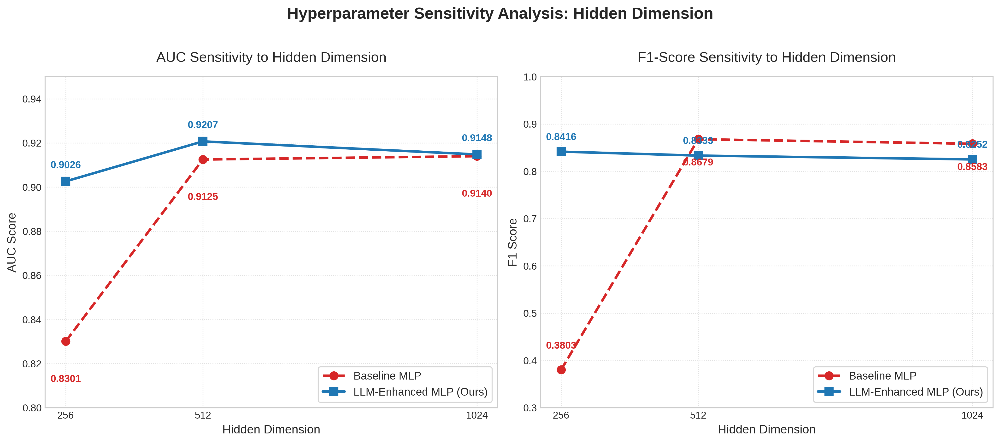

# Computable Phenotyping for Diabetes: An LLM-Enhanced Framework

**Course:** GMS6803 Final Project  
**Repository:** [github.com/juyujing/GMS6803](https://github.com/juyujing/GMS6803)

## 📖 Overview

This project proposes a novel deep learning framework to address the challenges of **high-dimensional, sparse Electronic Health Record (EHR) data** in computable phenotyping. 

Traditional models (like MLPs) often suffer from overfitting and mode collapse when dealing with sparse clinical features ($p \gg n$). Our solution integrates **Large Language Models (LLMs)** into the pipeline:
1.  **Prior Knowledge Injection:** Using **PubMedBERT** to transform sparse feature IDs into dense semantic embeddings for model initialization.
2.  **Post-hoc Interpretability:** Using **Llama-3** to generate clinical pathology reports, translating model weights into human-readable medical reasoning.

## 🚀 Key Features

* **LLM-Enhanced Initialization:** Maps 12,000+ sparse clinical feature codes into semantic space using `PubMedBERT`, providing robust initialization priors.
* **Stability & Robustness:** Outperforms baseline MLPs in training stability and AUC, specifically preventing "mode collapse" in imbalanced datasets.
* **Generative Explanation:** Integrates `Llama-3.3-70B-Instruct` to explain *why* a patient is classified as high-risk, citing specific clinical factors.
* **Data Efficiency:** Demonstrates superior performance even under constrained model capacities.

## 🛠️ Installation

### 1. Clone the Repository
```bash
git clone https://github.com/juyujing/GMS6803.git
cd GMS6803
```

### 2. Environment Setup

We provide a pre-configured environment.yml file containing all dependencies (optimized for GB-200/H100 environments).

Install dependencies directly from the file:

```bash
conda env create -f environment.yml
conda activate medical_llm
```

## 🏃 Usage Pipeline
### Step 1: Run Baseline Model (Standard MLP)

Train a standard Multi-Layer Perceptron as a benchmark.

```bash
python main.py \
    --exp_name "mlp_baseline_v1_lr1e-3_h512" \
    --epochs 50 \
    --batch_size 32 \
    --lr 0.001 \
    --hidden_dim 512 \
    --dropout 0.3 \
    --seed 42
```

### Step 2: Generate Semantic Embeddings

Extract medical concept embeddings using a pre-trained LLM. Note: We use openai/gpt-oss-20b or PubMedBERT.

```bash
python llm_embedder.py --llm_model "openai/gpt-oss-20b"
```

### Step 3: Train LLM-Enhanced Model (Ours)

Train the proposed model using the generated embeddings as initialization priors.

```bash
python main.py \
    --model_type llm_mlp \
    --emb_path dataset/feature_embeddings.npy \
    --exp_name "pubmedbert_weighted_h1024" \
    --lr 1e-4 \
    --hidden_dim 1024 \
    --epochs 50
```

### Step 4: Generate AI Explanations

Use a high-performance Instruct-LLM to interpret the model's predictions.

```bash
python explain.py \
    --checkpoint checkpoints/pubmedbert_weighted_h512_best_AUC_0.9546_lr_0.0001.pth \
    --hidden_dim 512 \
    --explainer_model "meta-llama/Llama-3.3-70B-Instruct"
```
## 📊 Results

### Performance Comparison
The LLM-Enhanced model demonstrates superior ranking capability (AUC) and training stability compared to the baseline.

| Metric | Baseline MLP | LLM-Enhanced MLP (Ours) |
| :--- | :---: | :---: |
| **AUC** | 0.9125 ± 0.001 | **0.9207 ± 0.001** |
| **F1-Score** | **0.8679 ± 0.001*** | 0.8333 ± 0.001 |

*\*Note: The baseline MLP's higher F1 is partially due to overfitting the majority class (mode collapse), while the LLM model adopts a balanced learning strategy (Class-Weighted Loss).*

### Sensitivity Analysis
The plot below illustrates the robustness of our model across different hidden dimensions. The LLM-Enhanced model (Blue) maintains high performance even at lower capacities, whereas the Baseline MLP (Red) suffers from performance degradation.



## 🧠 Model Interpretation (Case Study)

Unlike traditional feature importance scores, our framework provides human-readable clinical reasoning. Below is an actual output generated by the `explain.py` module for **Patient Case 3**:

> **=== Patient Case 3 ===**
>
> **Predicted Risk:** 86.24%
>
> **Raw Factors:** `['gender_concept_id', 'race_concept_id', 'age', 'cond_313217', 'cond_375806']`
>
> **Clinical Factors:** `['Gender', 'Race', 'Patient Age (Elderly)', 'Atrial fibrillation', 'Idiopathic peripheral neuropathy']`
>
> **AI Analysis:**
> The patient's risk profile suggests a high likelihood of Diabetes due to a combination of factors. The elderly age increases the risk of developing Diabetes, as pancreatic beta-cell function declines with age. Atrial fibrillation is also a significant risk factor, as it is often associated with underlying cardiovascular disease, which is a common comorbidity with Diabetes. **Idiopathic peripheral neuropathy is a red flag, as Diabetes is a leading cause of peripheral neuropathy, resulting from prolonged hyperglycemia damaging nerve fibers.** Furthermore, certain racial and ethnic groups are more prone to developing Diabetes, and while the specific race is not mentioned, it is likely a contributing factor. The cumulative effect of these risk factors, particularly the presence of idiopathic peripheral neuropathy, strongly suggests that the patient may have undiagnosed Diabetes, as peripheral neuropathy is a common microvascular complication of the disease. Therefore, a comprehensive diagnostic workup, including blood glucose tests, is warranted to confirm the diagnosis.

## 📂 Project Structure

```text
.
├── dataset/                # Data storage
│   ├── raw/                # Extracted SQL CSVs
│       ├── extract.sql
│       ├── extract2.sql
│       ├── feat_conditions.sql
│       └── feat_drugs.sql
│   ├── train.csv           # Processed training data
│   └── feature_embeddings.npy
├── model/
│   ├── mlp.py              # Baseline architecture
│   └── llm_mlp.py          # LLM-Enhanced architecture
├── checkpoints/            # Saved model weights
├── data_process.py         # ETL pipeline
├── llm_embedder.py         # Semantic embedding generation
├── main.py                 # Training entry point
├── explain.py              # Inference & Interpretation (Llama-3)
├── utils.py                # Logging & Seeding
├── environment.yml         # Conda environment configuration
└── README.md
